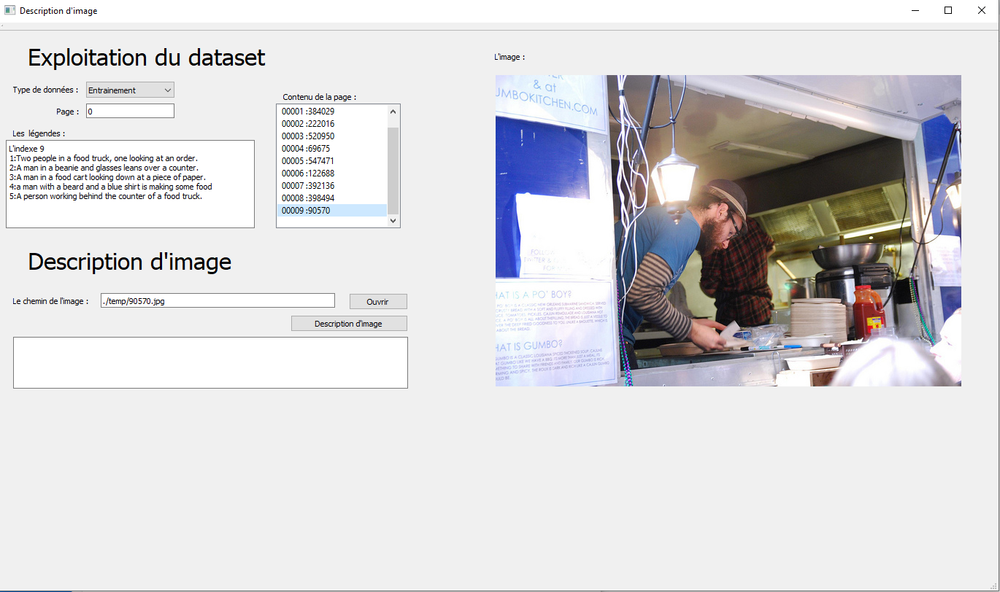

# PFE Description d'images en utilisant le Deep Learning

## Modèle  
Le code permettant de créer le modèle se trouve dans [create model colab/PFE.ipynb](https://github.com/A-RAMZI/PFE/blob/master/create%20model%20colab/PFE.ipynb)   
L'architecture du modèle est indiqué sur la figure ci-dessous :   

## Dataset  
[Plus d'informations sur MSCOCO Caption](https://cocodataset.org/#captions-2015)   
[Lien de téléchargement MSCOCO Caption](https://cocodataset.org/#captions-2015)  

téléchargement des images :
  * [2014 Train images  13 Go](http://images.cocodataset.org/zips/train2014.zip)
  * [2014 Val images     6 Go](http://images.cocodataset.org/zips/val2014.zip)  
  
téléchargent des annotations : [2014 Train/Val annotations  241 Mo](http://images.cocodataset.org/annotations/annotations_trainval2014.zip)

## Installation 
Les bibliothèques python nécessaires pour applications sont notées dans le fichier [all_lib.py](https://github.com/A-RAMZI/PFE/blob/master/all_lib.py)
L’ajout des bibliothèques de TensorFlow Api manuellement se fasse :
  * En executant le fichier install_api.bat sous windows 
  * En compilant le projet [TensorFlow API](https://github.com/tensorflow/models/) 
par protoc et en ajoutant les bibliothèques obtenues à python

## Utilisation 
Les codes dans le fichier [create dict data](https://github.com/A-RAMZI/PFE/tree/master/create%20data%20dict)  servent à extraire les données essentielles des fichiers Json du Dataset.
  
L'application permet de :
  * Parcourir le Dataset ( chaque partie train/val est découpée en pages de 10 items et chaque item contient une image et les descriptions correspondantes)
  * Décrire les images selon notre modèle ( il suffit d'indiquer le chemin d'acces à l'image)
  * Comparer les descriptions du dataset avec la déscription générée (si l'image appartient au Dataset)  
  
Lancement de l'application :
  
    python application.py
   
( des messages d'avertissement peuvent apparaître à l'utilisation de TensorFlow-CPU )

  

## Test results  
Les résultats Bleu-N sur les données de tests sont :
(0.3602033744470266, 0.1214666905397255, 0.03479153426583626, 0.010338026451352279)
